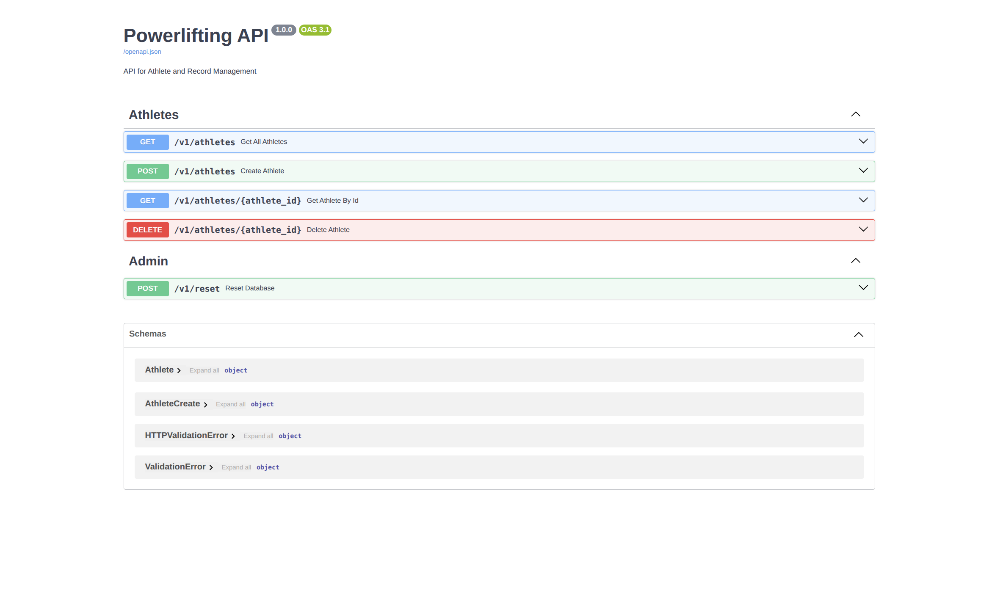

 # Powerlifting API
 
 [](https://fastapi.tiangolo.com/)
 [](https://www.python.org/)
 [](https://www.uvicorn.org/)
 [](https://supabase.com/)
 [](https://www.postgresql.org/)
 [](https://render.com/)
 [](https://railway.app/)
 [](https://github.com/features/actions)
 [](https://docs.pytest.org/)

 API for athlete and record management. Includes Swagger/OpenAPI, tests, and a sample data reset.

 

## Key features

- Professional API with FastAPI.
- Clean, typed code with Pydantic v2.
- Database with auto-reset capability.
- CI/CD (Continuous Integration and Deployment) in place.
- Automated tests that ensure nothing breaks.


 ---

 ## 🛠️ Tech Stack

 - **Language/Framework:** FastAPI (Python). Automatically generates OpenAPI/Swagger, very fast and easy to read.
 - **Database:** Supabase (PostgreSQL). Generous free tier and scalable.
 - **Deployment (Hosting):** Render or Railway. Free plans ideal for testing.
 - **Infrastructure:** GitHub Actions for CI/CD.

 ---

 ## 📄 Contract (Design-First)

 In FastAPI, code defines the contract (OpenAPI). Models live in `app/schemas.py` and the API bootstrap in `app/main.py`.

 ---

 ## 🌐 Environments

 - **Dev:** Localhost.
 - **Pre:** `develop` branch deployed on Render/Railway (e.g. `https://api-pre-powerlifting.onrender.com`).
 - **Prod:** `main` branch deployed on Render/Railway (e.g. `https://api-powerlifting.onrender.com`).

 Configure environment variables on each platform (e.g. `RENDER_DEPLOY_HOOK`).

 ---

 ## 🚀 CI/CD (GitHub Actions)

 Example workflow in `.github/workflows/night_batch_reset.yml` and (optional) a `deploy.yml` to:

 - **Linting**
 - **Tests (Pytest)**
 - **Deploy** (if tests pass)

 Make sure to define necessary `secrets`, e.g. `RENDER_DEPLOY_HOOK_PRO`.

 ---

 ## ▶️ Local run

 1. Create and activate a virtual environment
    
    ```bash
    python -m venv .venv
    source .venv/bin/activate  # Linux/macOS
    # .venv\\Scripts\\activate  # Windows
    ```

 2. Install dependencies
    
    ```bash
    pip install -r requirements.txt
    ```

 3. Run the server
    
    ```bash
    uvicorn app.main:app --reload --port 8000
    ```

 4. Open Swagger UI
    
    - http://localhost:8000/docs
    - OpenAPI JSON: http://localhost:8000/openapi.json

 ---

 ## 🧪 Tests

 Run the suite with Pytest:

 ```bash
 python3 -m pytest
 ```

 Example tests are in `tests/test_main.py`.

 ---

 ## 🔌 Main endpoints

 - **GET** `/v1/athletes` — List athletes.
 - **GET** `/v1/athletes/{athlete_id}` — Get athlete by id.
 - **POST** `/v1/athletes` — Create athlete.
 - **DELETE** `/v1/athletes/{athlete_id}` — Delete athlete.
 - **POST** `/v1/reset` — Reset data to initial state (in-memory).

 > Default data lives in `app/database.py`. For a manual reset from CLI, `app/reset_db.py` can call a Deploy Hook (Render/Railway) defined in `RENDER_DEPLOY_HOOK`.

 ---

 ## 📂 Project structure

 ```
 PowerliftingAPI/
 ├─ app/
 │  ├─ main.py          # FastAPI routes
 │  ├─ schemas.py       # Pydantic models
 │  ├─ database.py      # Default in-memory data
 │  └─ reset_db.py      # Script to request reset on hosting
 ├─ tests/
 │  └─ test_main.py     # Endpoint tests
 ├─ requirements.txt
 ├─ .github/workflows/  # CI/CD workflows
 └─ README.md
 ```

 ---

 ## 🧩 Deployment notes

 - Render/Railway: configure a web service with the start command:
   
   ```bash
   uvicorn app.main:app --host 0.0.0.0 --port $PORT
   ```
 - Define required variables/secrets (e.g. `RENDER_DEPLOY_HOOK`, `RENDER_DEPLOY_HOOK_PRO`).

 ---

> The API "sleeps" after 15 minutes of inactivity. The first time you open Swagger each day, it may take 30 seconds to load. This is not an error; Render is just waking your server.

 ## 📜 License

 MIT (or your preferred one). Add a `LICENSE` file if applicable.
